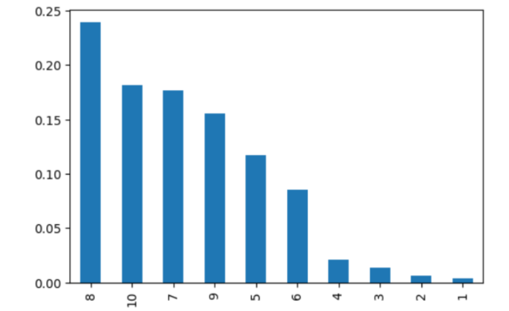
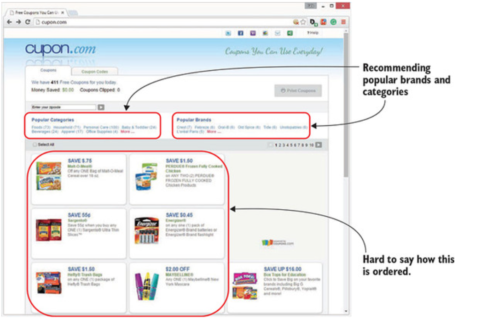

# 📚 Book Recommendation: Multi-Strategy Approach

## 📌 Tổng quan dự án
Dự án này tập trung vào việc xây dựng một hệ thống gợi ý sách đa phương pháp dựa trên bộ dữ liệu **Book Recommendation Dataset**. Thay vì chỉ sử dụng một thuật toán đơn lẻ, tôi đã triển khai 4 chiến lược khác nhau nhằm giải quyết các bài toán thực tế: từ gợi ý cho người dùng mới (Cold Start) đến cá nhân hóa chuyên sâu và tìm kiếm khách hàng mục tiêu cho nhà phát hành.

---

## 📊 1. Phân tích dữ liệu (EDA)
Trước khi xây dựng mô hình, dữ liệu được dọn dẹp và xử lý nhiễu để đảm bảo tính chính xác:
- **Xử lý Implicit Feedback:** Loại bỏ các bản ghi có Rating = 0 (trường hợp người dùng mua nhưng chưa đánh giá).
- **Lọc dữ liệu nhiễu:** Chỉ giữ lại các đầu sách và người dùng có đủ số lượng tương tác tối thiểu để đảm bảo tính thống kê.

**Thống kê chính:**
*   Số lượng đánh giá: **433,671**
*   Số lượng sách độc nhất: **185,973**
*   Số lượng người dùng: **77,805**
*   Điểm đánh giá trung bình: **7.6/10**

> *Insight: Người dùng có xu hướng đánh giá khá tích cực, tập trung chủ yếu ở mức điểm 7, 8 và 10.*

---

## 🚀 2. Các chiến lược gợi ý (Recommendation Strategies)

### 🔹 Chiến lược 1: Popularity-based (Gợi ý phổ thông)
Dành cho đối tượng người dùng mới chưa có lịch sử đọc sách. Hệ thống sẽ gợi ý những cuốn sách có lượt đánh giá cao nhất trong nhóm sách phổ biến (có trên 20 lượt đánh giá).
- **Kết quả:** Tìm ra các tác phẩm "quốc dân" như *Harry Potter, The Little Prince, The Return of the King...*

### 🔹 Chiến lược 2: Content-based Filtering (Tìm sản phẩm tương đồng)
Hệ thống phân tích Metadata của sách (Tên sách, Tác giả, Nhà xuất bản) để tìm ra các sản phẩm có đặc tính tương tự.
- **Kỹ thuật:** Sử dụng `CountVectorizer` và `Cosine Similarity`.
- **Ứng dụng:** Tính năng "Sách tương tự" khi khách hàng đang xem một sản phẩm cụ thể.
- **Ví dụ:** Khi xem sách về *Star Trek*, hệ thống sẽ gợi ý chính xác các tập khác cùng series hoặc cùng chủ đề không gian.

### 🔹 Chiến lược 3: Neighborhood-based Collaborative Filtering (Lọc cộng tác)
Sử dụng hành vi của cộng đồng để đưa ra gợi ý. Tôi đã xây dựng Class `CF` tùy biến để xử lý ma trận thưa (Sparse Matrix):

*   **User-User CF (Cá nhân hóa):** Tìm nhóm người dùng có sở thích tương đồng để gợi ý sách.
    *   **RMSE (Test): 1.62**
*   **Item-Item CF (Target Marketing):** Một cách tiếp cận ngược – Từ một cuốn sách, tìm ra danh sách những người dùng có khả năng sẽ thích nó nhất.
    *   **RMSE (Test): 1.75**
    *   **Ứng dụng:** Giúp nhà xuất bản xác định tập khách hàng mục tiêu cho các chiến dịch Marketing.

### 🔹 Chiến lược 4: Matrix Factorization (SVD)
Đây là phương pháp tiên tiến nhất trong dự án, sử dụng kỹ thuật phân rã ma trận để dự đoán các điểm đánh giá còn thiếu (Matrix Completion).
- **Kỹ thuật:** Sử dụng `svds` từ thư viện `scipy` để tìm ra các latent factors (yếu tố ẩn) của người dùng và sách.
- **Đánh giá:** Chỉ số **RMSE đạt 1.65** (trên thang điểm 10).
- **Case Study:** Gợi ý cho User ID 183. Kết quả trả về các đầu sách hoạt hình/thiếu nhi của Disney và Star Wars, hoàn toàn khớp với xu hướng sở thích của người dùng này.

---

## 📈 3. Đánh giá hiệu năng (Model Evaluation)

Bảng so sánh sai số giữa các phương pháp dự đoán điểm (Rating Prediction):

| Thuật toán | RMSE (Test) | Ứng dụng chính |
| :--- | :--- | :--- |
| **User-based CF** | **1.62** | Dự đoán sở thích cá nhân chính xác nhất. |
| **SVD (Model-based)** | **1.65** | Tối ưu cho hệ thống lớn, tốc độ phản hồi nhanh. |
| **Item-based CF** | **1.75** | Phân loại và tìm kiếm khách hàng mục tiêu. |

---

## 🛠 Công cụ & Thư viện
- **Ngôn ngữ:** Python
- **Xử lý dữ liệu:** Pandas, NumPy
- **Thuật toán & Tính toán:** Scikit-learn, Scipy (Sparse Matrix)
- **Trực quan hóa:** Matplotlib

